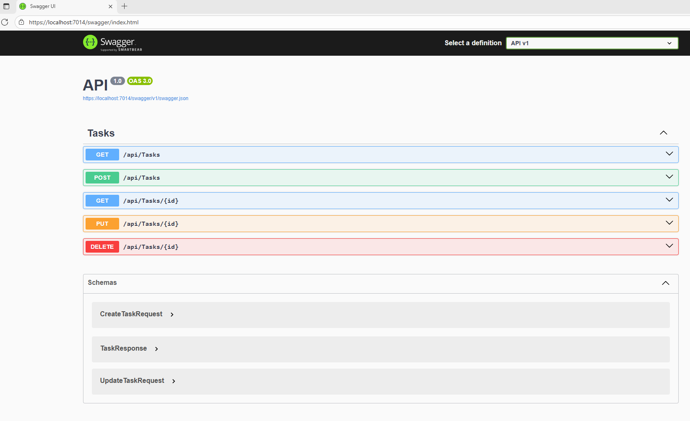
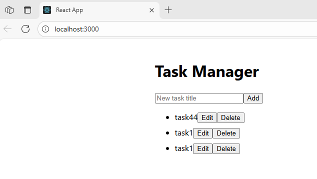

TaskManager is an application that allows users to create, update and delete tasks.

The backend of the application is implemented with .NET and ASP.NET Core.
It provides HTTP endpoints that receive CRUD commands.

In the first part of the implementation, only the backend was present and Swagger was used for the development process.
Swagger is still present in the final version.

The frontend is a React application that provides an UI for interacting with the resources. It communicates with the .NET backend API over HTTP using Axios.

## 1. How to run the app:
1. Start the backend
Load the TaskManagerApp.sln solution file in Visual Studio and start the app.
This will also do the build step. This way, the backend is started. 
A swagger interface will open at this address: https://localhost:7014/swagger/index.html

From this page, the REST API is available. The user can perform CRUD operations.

2. Start the frontend
Install npm, if not already installed: npm install
Go to the frontend folder and start the server: npm start
This will start the frontend, that will connect to the previously started backend.
Add, Edit and Delete are available as commands; all existing tasks are shown.

## 2. Code design
The code is organized in a DDD manner. This ensures separation of concerns.

* The API layer contains the controller and the DTOs for handling HTTP requests/responses.

* The Infrastructure layer contains an implementation of a repository, where data is held in memory. If needed, a new implementation can be injected in the future, using a database.

* The Domain layer implements the business logic of the app.

Dependency Injection is implemented using the default DI container in dotnet.

## 3. Future improvements
### Unit tests are not implemented yet
Unit tests can be implemented using MSTest and Moq, or other technologies.
